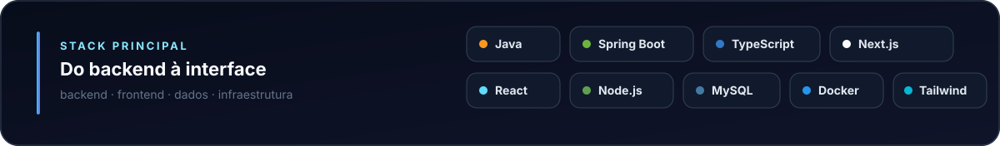
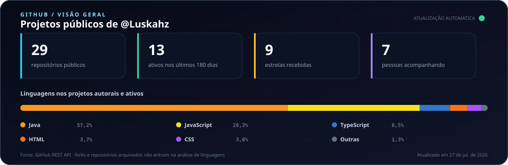

  

  
  
  

 

## Sobre mim

Sou estudante de **Análise e Desenvolvimento de Sistemas no IFSP** e desenvolvedor com foco em backend. Trabalho na interseção entre **software, dados e operação logística**, transformando processos reais em APIs, automações e produtos que precisam funcionar fora do slide.

- Construo backends com **Java, Spring Boot, Node.js e bancos relacionais**.
- Desenvolvo produtos web com **Next.js, React, TypeScript e Tailwind CSS**.
- Tenho interesse especial por **arquitetura, autenticação, integrações e engenharia de dados**.
- Estou no Litoral Norte de São Paulo, Brasil.

  

## Projeto em destaque

<table>
  <tr>
    <td colspan="2">
      <h3>LogImaruí — plataforma de operação logística</h3>
      

        Ecossistema full stack criado para transformar rotinas logísticas, indicadores e regras operacionais
        em uma plataforma integrada. O projeto reúne aplicação web, API central e cliente mobile.
      

      

        <a href="https://github.com/Luskahz/logimarui-frontend-web"><strong>Aplicação web</strong></a>
        &nbsp;·&nbsp;
        <a href="https://github.com/Luskahz/logimarui-core-api"><strong>Core API</strong></a>
        &nbsp;·&nbsp;
        <a href="https://github.com/Luskahz/logimarui-frontend-react-native"><strong>Aplicação mobile</strong></a>
      

      

        <code>Next.js</code>
        <code>React</code>
        <code>TypeScript</code>
        <code>Java</code>
        <code>Spring Boot</code>
        <code>MySQL</code>
      

    </td>
  </tr>
  <tr>
    <td width="50%" valign="top">
      <h3>Jeep Club API</h3>
      

        API modular para gestão de associados, dependentes, autenticação, permissões e eventos,
        organizada com princípios de arquitetura hexagonal.
      

      

        <a href="https://github.com/Luskahz/jeep-club-backend"><strong>Ver repositório →</strong></a>
      

      

        <code>Java</code>
        <code>Spring Boot</code>
        <code>JWT</code>
        <code>JPA</code>
        <code>MySQL</code>
      

    </td>
    <td width="50%" valign="top">
      <h3>Agente Escolar</h3>
      

        Sistema acadêmico para administrar alunos, professores, cursos, turmas e disciplinas
        por meio de uma API REST e interface web.
      

      

        <a href="https://github.com/Luskahz/IFSP-ProjetoPortifolio-AgenteEscolar"><strong>Ver repositório →</strong></a>
      

      

        <code>Node.js</code>
        <code>Express</code>
        <code>Prisma</code>
        <code>MySQL</code>
      

    </td>
  </tr>
</table>

## GitHub em números

  

  
<strong>Como este perfil funciona por trás</strong>

   
  

    Este README também é um pequeno projeto: um script Node.js consulta somente dados públicos
    da API do GitHub, calcula as métricas e gera o painel SVG acima. Um workflow testa e atualiza
    o arquivo automaticamente, sem serviço pago e sem dependências de produção.
  

  

    <a href="./src/generate-profile.mjs"><strong>Ver o gerador</strong></a>
    &nbsp;·&nbsp;
    <a href="./test/generate-profile.test.mjs"><strong>Ver os testes</strong></a>
    &nbsp;·&nbsp;
    <a href="./.github/workflows/update-profile.yml"><strong>Ver a automação</strong></a>
  

 

  Construindo software com contexto, regra de negócio e responsabilidade técnica.

