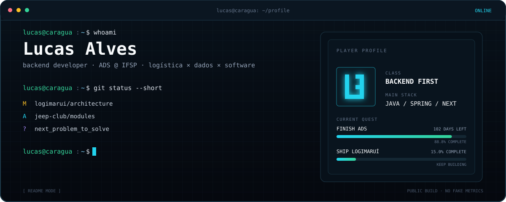
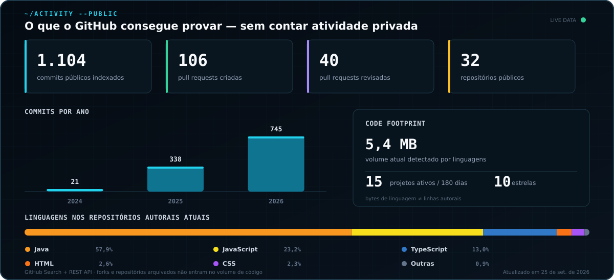

<div align="center">
  
</div>

<p align="center">
  <a href="mailto:lucasalvesdemelolins@gmail.com"></a>
  <a href="https://linkedin.com/in/lucasalvesdemelolins"></a>
  <a href="https://github.com/Luskahz"></a>
  
</p>
Meu código normalmente começa longe do editor: uma rota atrasada, um indicador difícil de explicar,
uma planilha repetitiva ou uma regra de negócio espalhada em cinco lugares. A parte que me interessa é
entender isso direito e transformar em sistema — API, automação, dashboard ou produto completo.

> Os números abaixo são calculados pelo próprio repositório. Atividade privada não entra e “volume de
> código” significa bytes das linguagens nos repositórios públicos atuais — não uma contagem inventada
> de linhas escritas.

<div align="center">
  
</div>

<div align="center">
  
</div>

<p align="center">
  <a href="https://github.com/Luskahz/logimarui-frontend-web"><strong>01 / LogImaruí Web</strong></a>
  &nbsp;·&nbsp;
  <a href="https://github.com/Luskahz/logimarui-core-api"><strong>Core API</strong></a>
  &nbsp;·&nbsp;
  <a href="https://github.com/Luskahz/logimarui-frontend-react-native"><strong>Mobile</strong></a>
  <br />
  <a href="https://github.com/Luskahz/jeep-club-backend"><strong>02 / Jeep Club API</strong></a>
  &nbsp;·&nbsp;
  <a href="https://github.com/Luskahz/IFSP-ProjetoPortifolio-AgenteEscolar"><strong>03 / Agente Escolar</strong></a>
</p>

## `./stack`

<p>
  <code>Java 21</code>
  <code>Spring Boot</code>
  <code>Spring Security</code>
  <code>JWT</code>
  <code>JPA</code>
  <code>Node.js</code>
  <code>TypeScript</code>
  <code>Next.js</code>
  <code>React</code>
  <code>MySQL</code>
  <code>Docker</code>
  <code>Power BI</code>
</p>

```java
public final class CurrentFocus {
    private final String architecture = "modular, testable, observable";
    private final String product = "software que resolve operação real";
    private final boolean finished = false; // ship, measure, improve
}
```

<details>
  <summary><strong>Como este perfil funciona por trás</strong></summary>
  <br />
  <p>
    Um gerador Node.js consulta a API pública do GitHub, soma atividade indexada, calcula a
    distribuição de linguagens e produz o SVG do painel. Os testes usam apenas o runner nativo
    do Node. O workflow atualiza os números semanalmente.
  </p>
  <p>
    O carrossel é um SVG animado porque o GitHub remove JavaScript do README. O jogo interativo
    fica no GitHub Pages e também não usa framework nem serviço pago.
  </p>
  <p>
    <a href="./src/generate-profile.mjs"><strong>gerador</strong></a>
    &nbsp;·&nbsp;
    <a href="./test/generate-profile.test.mjs"><strong>testes</strong></a>
    &nbsp;·&nbsp;
    <a href="./.github/workflows/update-profile.yml"><strong>automação das métricas</strong></a>
    &nbsp;·&nbsp;
    <a href="./.github/workflows/deploy-arcade.yml"><strong>deploy do arcade</strong></a>
  </p>
</details>

<br />

<p align="center"><sub>read the problem · model the rule · ship the code · measure the result</sub></p>
